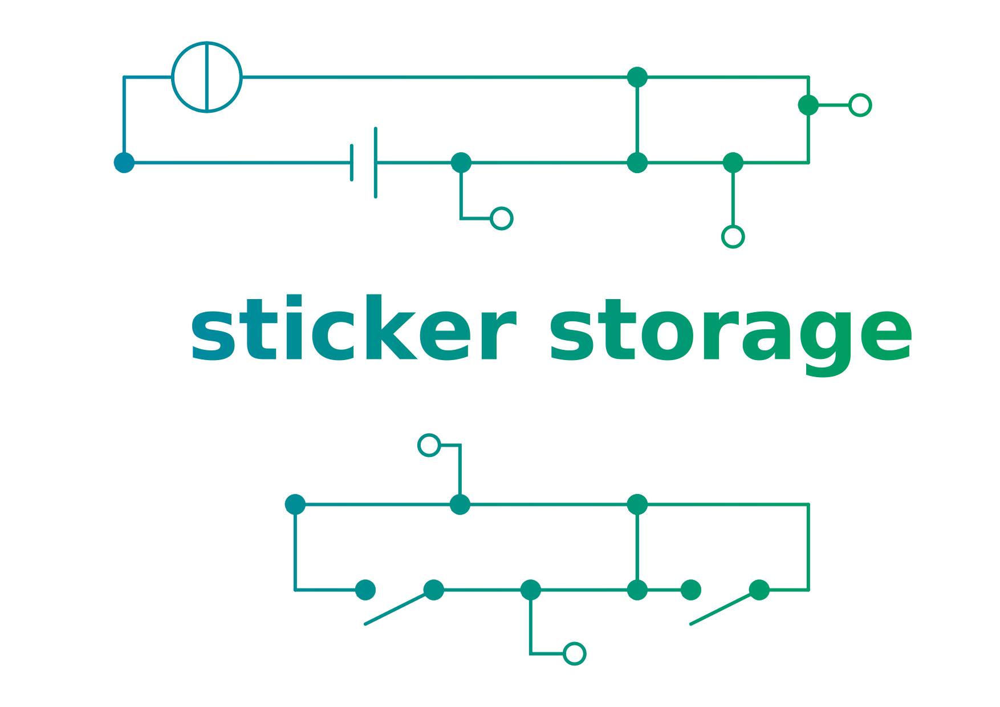

  

  

# Plan4BA

Plan4BA provides a personalized lecture plan and meal plan for students of the universities that are part of [Berufsakademie Sachsen](https://www.ba-sachsen.de/) (BA) in Saxony, Germany.

It's used in [production](https://plan4ba.ba-leipzig.de)! :rocket:

## The problem

Students at a BA university use a system called Campus Dual to check their lectures. But this system is really slow, not responsive and you have to log in every time.

## The solution

Plan4BA is caching and updating the personalized lectures and exams from the system Campus Dual. The user can stay logged in to view the lecture plan with a nice and responsive user interface in seconds. Plan4BA also provides some additional functionality. The user receives a notification, if there are changes in the lecture plan.

## Requirements

- [Node.js](https://nodejs.org/en/download/) and npm (included in the Node.js installation)
- [Angular CLI](https://github.com/angular/angular-cli) (recommended) with `npm install -g @angular/cli`

## Preparation

Before running anyting, you have to install the dependencies by running `npm install` in the root directory of this project.
To send api requests to the backend, you can use the [integrated proxy](https://github.com/angular/angular-cli/blob/master/docs/documentation/stories/proxy.md) of the angular cli development server. This is necessary, because the browser tries to prevent XSS-Attacks. To use the proxy, you can create a copy of the example file `cp proxy/proxy/proxy.conf.example.json proxy/proxy.conf.json`. Then you have to change the target url for your local setup.

## Maintainers

|  |  |
| :----------------------------------------------------------------------------------------------------------------------------------: | :------------------------------------------------------------------------------------------------------------------------: |
|                                           [Robert-Beier](https://github.com/Robert-Beier)                                            |                                             [DDKFM](https://github.com/DDKFM)                                              |

Robert Beier is maintaining the Angular Web-Application. DDKFM is maintaining the server-side microservices. You can find them in our Github organization [Plan4BA](https://github.com/Plan4BA).

## How to use it

You can basically only use it, if you have credentails to the Campus Dual System. Sorry.

## Run

You can run a development web server with the Angular CLI using `ng serve`. If you want to use the integrated proxy of the angular cli development server, as mentioned in "Preparation", you need to run `ng serve --proxy-config proxy/proxy.conf.json`.

## Build

To build the web app run `ng build --prod`.

## Mobile App

We use [Apache Cordova](https://cordova.apache.org/) to generate mobile apps. In order to generate a mobile app, follow these steps:

1. Install the cordova CLI by executing `npm install -g cordova`
2. Create an application folder by executing `cordova create plan4BA_mobile de.ba-leipzig.plan4ba "Plan4BA"`
3. Navigate into the folder using `cd plan4BA_mobile`
4. Add the desired platform, for example android, by executing `cordova platform add android`
5. In the root directory of this Angular application, run `ng build --prod --base-href . --output-path ../Plan4plan4BA_mobileBA/www/` (adjust the output path)
6. Add `` to the generated index.html file
7. Build for your desired platform, for example android, by executing `cordova build android`

For further information, read [this guide](https://medium.com/@EliaPalme/how-to-wrap-an-angular-app-with-apache-cordova-909024a25d79).
